# Russian Propaganda: Analysis of Channel One News

**Contributors**

*Mariia Luzan* ([https://github.com/MariiaLuzan](https://github.com/MariiaLuzan))

*Riccardo Ricci* ([https://github.com/Rick0701](https://github.com/Rick0701))

**Main Tools**

Other Tools: scrapy, spacy, NLP, matplotlib, Vega-Altair

### Motivation

The Russian society is divided on the issue of whether to support the war with Ukraine, with even members of the same family holding opposing views. Those who support the war often rely on television as their primary source of information, with its broadcasts playing a significant role in shaping public opinion. This project was undertaken to gain a deeper understanding of the propaganda methods used to sway public opinion effectively.

Using these sources, we developed several hypotheses to investigate whether these techniques are utilized by Russian propaganda:

- Frequent use of catchy slogans that are short, simple, and easy to remember;
- Frequent news stories about the heroes of the “special military operation”;
- Instilling the idea that Putin is the one and only leader who cannot be replaced;
- Frequent use of words in relation to Ukrainians that elicit strong negative reactions and fear.

In addition, our objective is to gain a better understanding of the effectiveness of propaganda. To achieve this, we compare the monthly time series data of news coverage duration on the topic of Ukraine to the time series data of Russians' attitudes toward Ukraine

### Data Sources

To obtain our initial dataset, we conducted a *web scraping* of the Russian Channel One website, which includes transcripts of their news broadcasts.

The secondary datasets is obtained from the website of the Levada Center (https://www.levada.ru/en/), an independent organization that conducts surveys in Russia. This dataset provides time series data concerning the attitudes of Russians towards Ukraine.

### Methodology

- **Scraping** was performed using the *scrapy* library in *python*. See the *appendix* below for an example of the sections we scraped from the Russian Channel One website. The *scraping* folder contains the pyhon scripts used for scraping. The output of this step is 24 csv files containing the scraped news. See the files *data/\*cleaned.csv*
- We used *Pandas* for **Data Manipulation and Cleaning** such as reading and concatenating these csv files, adding columns, removing duplicates. See the notebooks 2.0, 2.1, and 2.2.
- We **process textual data** (e.g. lemmatization, tokenization, exclusion of stop word) using the NLP *spacy* library. See the notebook 2.3. The output of this step is a large csv file (more than 2GB) containing for each news the list of token. See the first 100 rows in *data/df_tokenized.csv*.
- We **analyzed** our data using *Pandas* and created **data visualizations** using the *matplotlib* and *Vega-Altair* libraries.

### Findings

#### Patterns of news releases in general

1. News duration increased dramatically right after the commencement of the SMO (the so-called Special Military Operation by Russia)

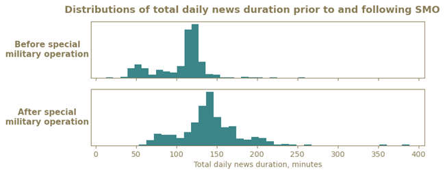

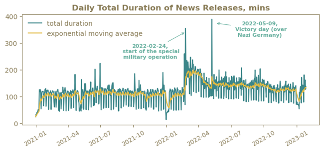

2. Daily total duration of political programs has increased after the SMO

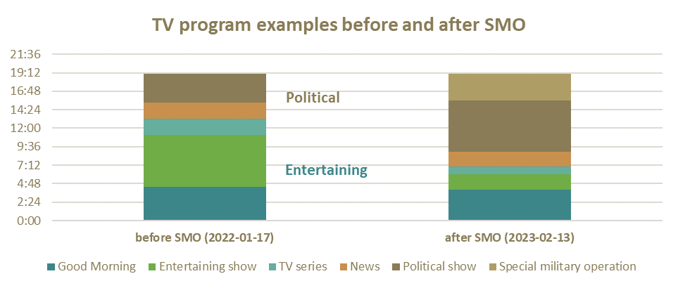

3. Although news intensity has increased, it follows the same work-holiday approach.

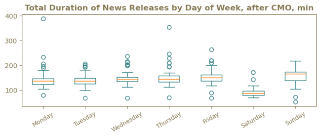

4. Russian news is substantially changing its coverage targets in order to focus audience attention on particular events that might be important for the government

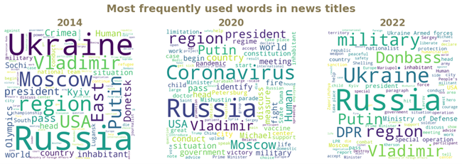

#### Frequency of catchy slogans

5. Catchy slogans such as *Collective West* and *Never abandon our people* have steadily increased.
   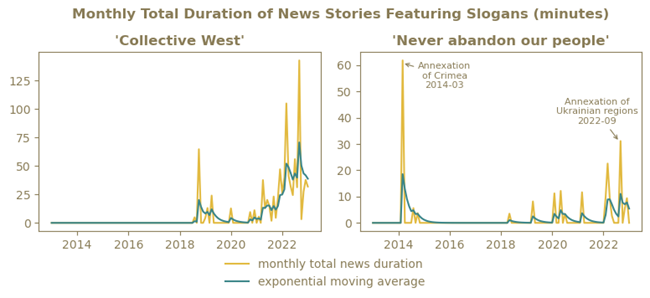

#### Comparison between the frequency of news stories aired about V. Putin and that of other individuals

6. There is a significant disparity in the number and duration of news stories featuring Putin compared to any other official promoting the perception that Putin is the only competent leader.

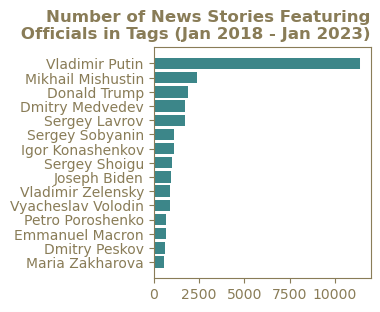
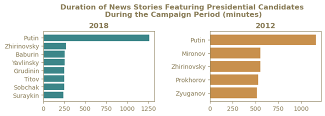

#### Words that are used in relation to Ukrainians

7. Russian propaganda often employs language to describe Ukrainians that elicits intense negative emotions and fear. Specifically, words such as nationalist, Nazi, and radical are frequently used

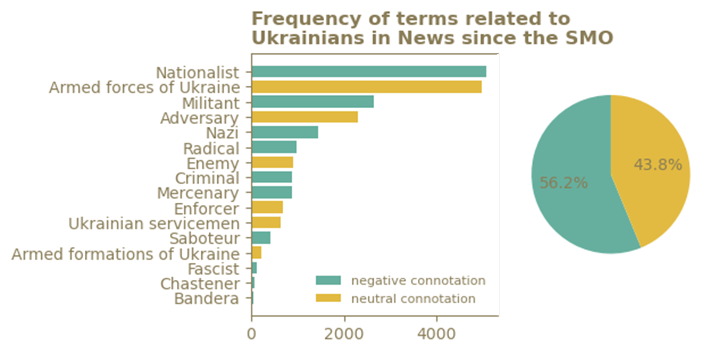

#### Comparison of a duration of news coverage on Ukraine with Russians attitudes towards Ukraine

8. Major spikes in negative attitudes corresponded to major spikes in news volume, such as the peaks related to the Crimea annexation in 2014 and the Russian-Ukrainian war in 2022

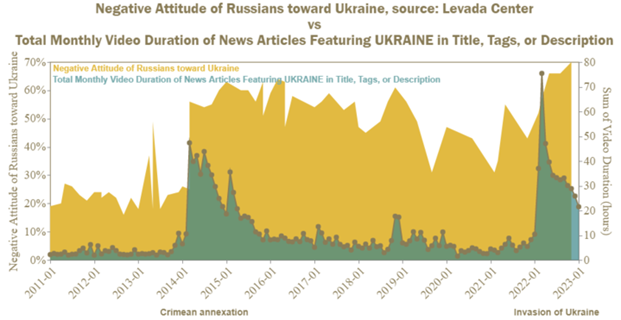

### Appendix

**Scraping Sections**

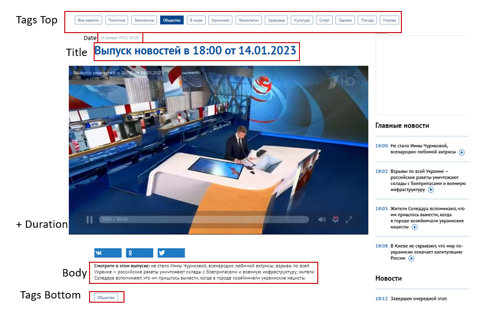

Source: [https://www.1tv.ru/news](https://www.1tv.ru/news)
